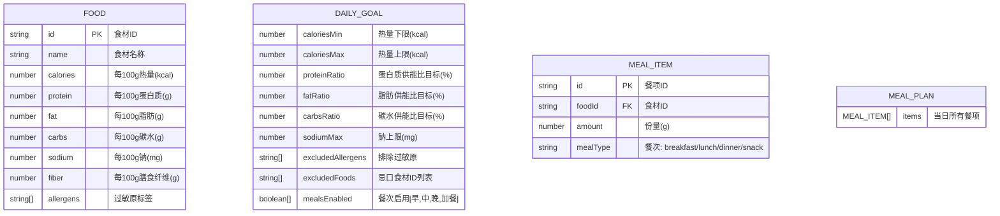

## 1. 架构设计

```mermaid
graph TD
    "浏览器 (纯前端)" --> "Vite + React 18 + TS"
    "Vite + React 18 + TS" --> "Zustand 状态管理"
    "Zustand 状态管理" --> "localStorage 持久化"
    "Vite + React 18 + TS" --> "UI 组件层"
    "UI 组件层" --> "目标设置面板"
    "UI 组件层" --> "食材库管理"
    "UI 组件层" --> "餐单编辑区"
    "UI 组件层" --> "营养仪表盘 (Recharts)"
    "UI 组件层" --> "智能配餐触发"
    "Vite + React 18 + TS" --> "业务逻辑层"
    "业务逻辑层" --> "营养计算工具"
    "业务逻辑层" --> "智能配餐策略接口"
    "智能配餐策略接口" --> "贪心搜索策略实现"
    "智能配餐策略接口" --> "(预留)其他算法"
    "业务逻辑层" --> "JSON 导入导出"
```

## 2. 技术描述
- **前端框架**：React 18 + TypeScript
- **构建工具**：Vite（dev server 端口 6730）
- **样式**：Tailwind CSS 3
- **状态管理**：Zustand
- **图表库**：Recharts（轻量 React 图表库，支持环形图、进度条）
- **图标库**：lucide-react
- **后端**：无（纯前端，所有数据存浏览器 localStorage）
- **数据库**：无（localStorage + JSON 文件导入导出）

## 3. 路由定义
单页应用，无需路由。所有功能在主页面展示。

| 路由 | 用途 |
|------|------|
| / | 主页面（包含所有功能模块） |

## 4. API 定义
无后端 API。所有逻辑在前端完成。

## 5. 数据模型

### 5.1 数据模型 ER 图



### 5.2 核心类型定义（TypeScript）

```typescript
// 过敏原类型
type Allergen = 'gluten' | 'dairy' | 'nuts' | 'eggs' | 'soy' | 'seafood' | 'shellfish';

// 食材
interface Food {
  id: string;
  name: string;
  calories: number;      // kcal / 100g
  protein: number;       // g / 100g
  fat: number;           // g / 100g
  carbs: number;         // g / 100g
  sodium: number;        // mg / 100g
  fiber: number;         // g / 100g
  allergens: Allergen[];
}

// 餐次类型
type MealType = 'breakfast' | 'lunch' | 'dinner' | 'snack';

// 餐项
interface MealItem {
  id: string;
  foodId: string;
  amount: number;        // g
  mealType: MealType;
}

// 每日目标
interface DailyGoal {
  caloriesMin: number;
  caloriesMax: number;
  proteinRatio: number;  // %
  fatRatio: number;      // %
  carbsRatio: number;    // %
  sodiumMax: number;     // mg
  excludedAllergens: Allergen[];
  excludedFoods: string[];
  mealsEnabled: Record<MealType, boolean>;
}

// 营养计算结果
interface NutritionSummary {
  totalCalories: number;
  totalProtein: number;
  totalFat: number;
  totalCarbs: number;
  totalSodium: number;
  totalFiber: number;
  proteinEnergyRatio: number;  // %
  fatEnergyRatio: number;      // %
  carbsEnergyRatio: number;    // %
}

// 智能配餐策略接口
interface MealPlannerStrategy {
  name: string;
  plan(foods: Food[], goal: DailyGoal): { items: MealItem[]; message: string; success: boolean };
}
```

## 6. 项目结构

```
src/
├── components/           # UI 组件
│   ├── GoalPanel.tsx         # 目标设置面板
│   ├── FoodLibrary.tsx       # 食材库侧边栏
│   ├── FoodEditor.tsx        # 食材编辑弹窗
│   ├── MealSection.tsx       # 单餐卡片
│   ├── MealItemRow.tsx       # 餐项行（食材+份量）
│   ├── NutritionDashboard.tsx # 营养仪表盘
│   ├── MacroDonutChart.tsx   # 三大营养素环形图
│   ├── ProgressBar.tsx       # 达标进度条
│   ├── SmartMealButton.tsx   # 智能配餐按钮
│   └── TopBar.tsx            # 顶部导航栏
├── hooks/               # 自定义 hooks
│   └── useLocalStorage.ts    # localStorage hook
├── store/               # Zustand store
│   └── useMealStore.ts       # 全局状态
├── utils/               # 工具函数
│   ├── nutrition.ts          # 营养计算
│   ├── id.ts                 # ID 生成
│   └── io.ts                 # JSON 导入导出
├── strategies/          # 智能配餐策略（可插拔）
│   ├── types.ts              # 策略接口定义
│   └── greedyPlanner.ts      # 贪心搜索策略实现
├── data/                # 初始数据
│   └── defaultFoods.ts       # 内置食材库
├── types/               # 全局类型定义
│   └── index.ts
├── App.tsx
├── main.tsx
└── index.css
```

## 7. 关键实现说明

### 7.1 营养计算
- 份量折算：`实际值 = (每100g值 × 份量) / 100`
- 供能比计算：蛋白 4 kcal/g，脂肪 9 kcal/g，碳水 4 kcal/g
  - `蛋白质供能 = 蛋白质克数 × 4`
  - `蛋白质供能比 = 蛋白质供能 / 总供能 × 100%`

### 7.2 智能配餐贪心策略
1. 过滤掉含排除过敏原和忌口的食材
2. 按餐次分配热量比例（早餐 25%、午餐 35%、晚餐 30%、加餐 10%，可调整）
3. 每餐内按「主食 + 蛋白 + 蔬菜」结构挑选食材
4. 使用迭代调整：逐步增减各食材份量，逼近目标供能比和热量区间
5. 检查钠不超标
6. 返回失败时列出不满足的约束

### 7.3 本地存储
Zustand store 订阅变化，自动持久化到 localStorage，key 为 `meal-planner-state`。
